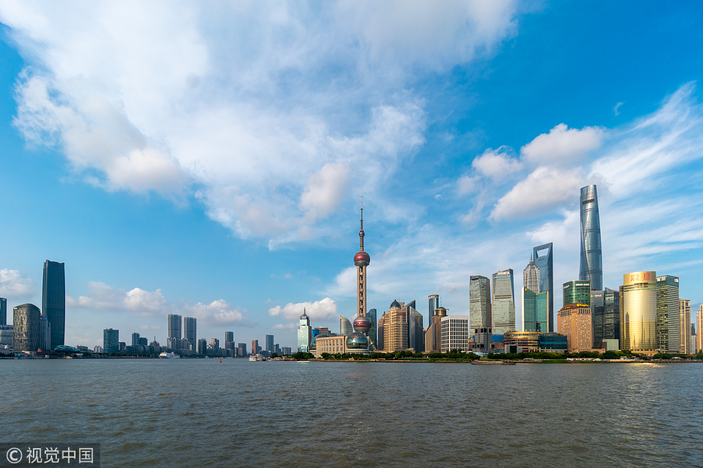
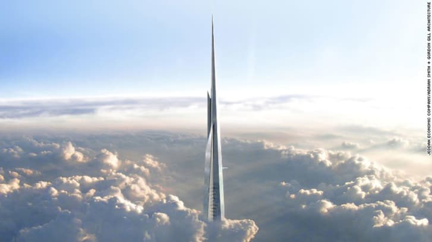

# Welcome to SuperZCN Pages

**SuperZCN：Tasted the sweet perfume of the mountain grass I rolled down.From *[Castle on the Hill](https://y.qq.com/n/yqq/song/000AnymG3bg0be.html?play=1)*** .

If you saw the darkness in front of you, don't be afraid, that's because sunshine is at your back.                    
如果你看到面前的阴影，别怕，那是因为你的背后有阳光。

                                                                                                                          

### Experts predict a positive Chinese economy

Chinese economists and foreign research institutions predict a positive Chinese economy, thanks to the country's stable operation of the supply side, improved domestic demand and supply relationship, and optimized economic structure, despite of the increasing uncertainties of home and abroad economic environment, people.com.cn reported. 

The skyline of Shanghai is seen on June 15, 2018. [Photo/VCG] 

- ##### **Strong physical quantity indexes** 

From physical quantity indexes such as power consumption and traffic volume, the whole society's power consumption in May rose 11.4 percent, with a growth increase of 6.4 percentage points year-on-year. Among them, secondary industry electricity consumption witnessed a growth of 7.7 percent on a yearly basis, accounting for 55.6 percent of electricity consumption in the whole society.

In the first five months of this year, China's railway goods delivery increased by 6.9 percent year-on-year. "A series of indicators, such physical quantity indexes, have continued to improve, releasing positive signals of the stabilization of the real economy and the continued progress of structural transformation,” said Niu Li, an economist with the State Information Center of the National Development and Reform Commission.

- ##### **Consumer confidence climbs** 

According to the China's consumer confidence report of Q1, 2018 released by Nielsen, a global monitoring and data analysis firm, China's consumer confidence index set a record for the past 10 years, up to 115 points, with 1 point increase compared with the previous quarter.

"At present, the consumer market is basically stable, and the momentum of consumption upgrading continues unabated. Online retail continues to lead growth. Sales of communications equipment, oil and products have all increased rapidly. As the national economy continues to stabilize and improve, a series of policy effects, such as increasing effective supply, reducing taxes and fees, are gradually emerging. It is expected that the consumer market will continue to grow steadily in the later period,” Niu added.

*From [China Daily](http://www.chinadaily.com.cn/a/201806/19/WS5b289b3fa310010f8f59d9ed.html)*

### Jeddah Tower: What does the world's next tallest skyscraper look like now?

These are the images that show what will soon be known as the world's next tallest building rising from the desert. When the 3,280-feet-tall (1,000-meter-tall) Jeddah Tower, in Saudi Arabia, opens in 2020, it will knock Dubai's iconic Burj Khalifa off its throne as the tallest skyscraper in the world by 236 feet (72 meters). Construction of the landmark is estimated to cost $1.4 billion. 

- ##### Rising power

Jeddah Tower's construction fits into [Saudi Vision 2030](http://vision2030.gov.sa/en), a government plan that aims to diversify the economy in the kingdom and reduce its dependence on oil.

"Vision 2030 is the development strategy of the project ... this is the instruction we have given to the architects and to the urban planners," explains Hammoud.

- ##### A global landmark

While today the site is surrounded by desert, upon completion the tower will be the center of the Jeddah Economic City development.

"As of 2020, we'll start seeing things: you'll see the tower, you'll see the shopping mall, you'll see many other projects," says Mounib Hammoud, CEO of Jeddah Economic Company.

Boasting a gross floor area of 2.6 million square feet (243,866 square meters) over 252 stories, the tower will also feature the world's highest observation deck at 2,178 feet (664 meters) off the ground, with a 5,382 square feet (500 square meter) outdoor platform.

*From [CNN](https://edition.cnn.com/style/article/jeddah-tower-saudi-arabia-new/index.html)*
$$
E=mc^2
$$
